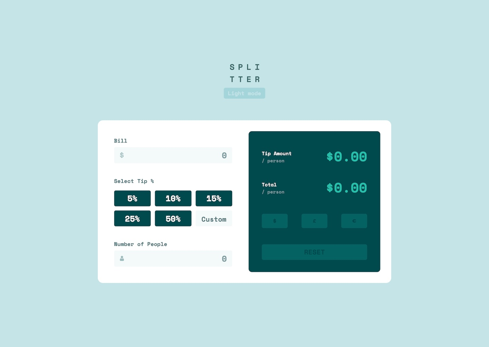

# Frontend Mentor - Tip calculator app solution

This is a solution to the [Tip calculator app challenge on Frontend Mentor](https://www.frontendmentor.io/challenges/tip-calculator-app-ugJNGbJUX). Frontend Mentor challenges help you improve your coding skills by building realistic projects.

## Table of contents

- [Overview](#overview)
  - [The challenge](#the-challenge)
  - [Screenshot](#screenshot)
  - [Links](#links)
- [My process](#my-process)
  - [Built with](#built-with)
  - [What I learned](#what-i-learned)
  - [Continued development](#continued-development)
- [Author](#author)

### The challenge

Users should be able to:

- View the optimal layout for the app depending on their device's screen size
- See hover states for all interactive elements on the page
- Calculate the correct tip and total cost of the bill per person

### Screenshot

### Links

- Solution URL: [Add solution URL here](https://achrustowski.github.io/tip-calculator-main-app/)
- Live Site URL: [Add live site URL here](https://achrustowski.github.io/tip-calculator-main-app/)

## My process

I started with laying out elements using mix of flexbox (mostly with flex-direction set to column) and grid. I styled elements that will change with Dark Mode inside HTML using CSS custom variables and other in CSS. For the logic implementation I used vanilla JS with lots of functions and some if/ if else statements.

### Built with

- Semantic HTML5 markup
- CSS custom properties
- Flexbox
- CSS Grid
- Mobile-first workflow
- Vanilla JS

### What I learned

I recaped a lot about JS and creating logic for different cases scenarios. I managed to debug my own code pretty well and overall I'm happy with ly work :)

### Continued development

Continued development of my understanding in CSS flex and grid as well as Vanilla JS.

## Author

- Frontend Mentor - [@achrustowski](https://www.frontendmentor.io/profile/achrustowski)
- Twitter - [@achrustowski](https://github.com/achrustowski)
